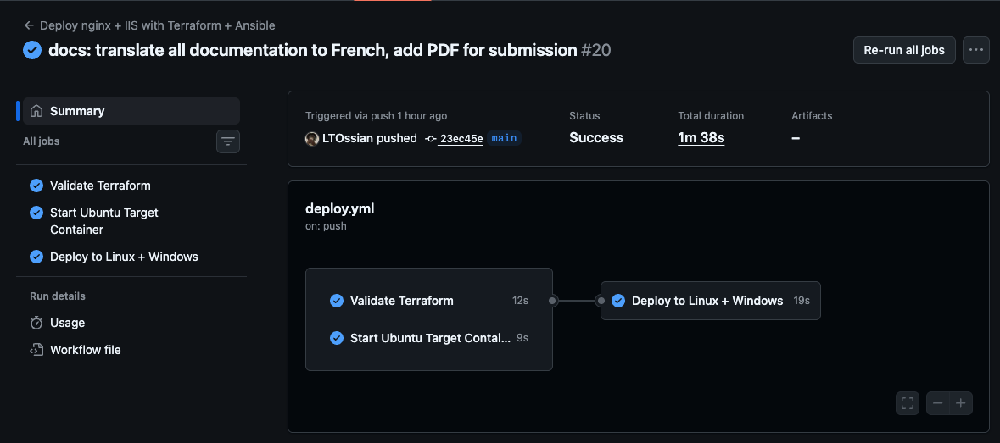
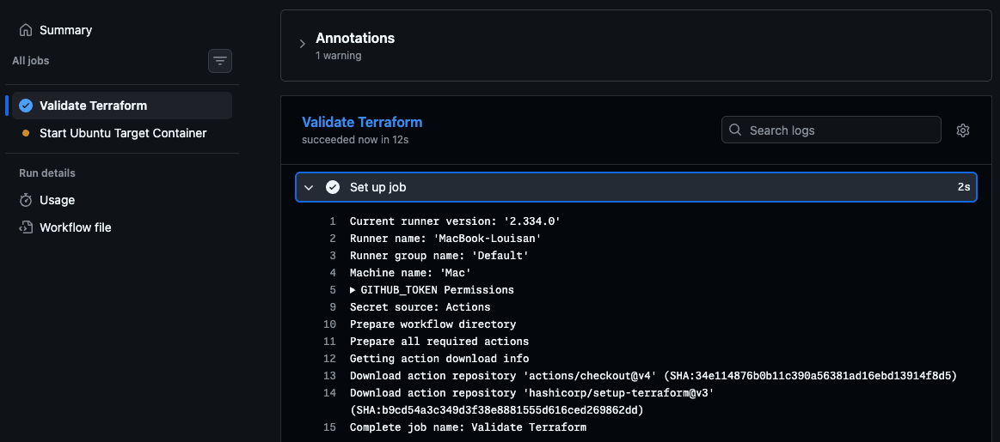
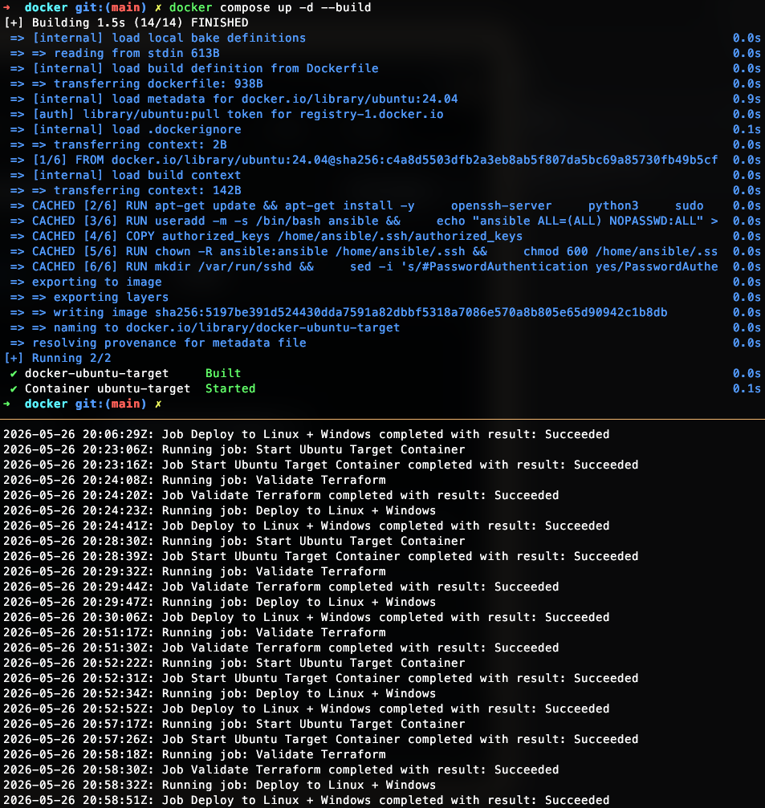
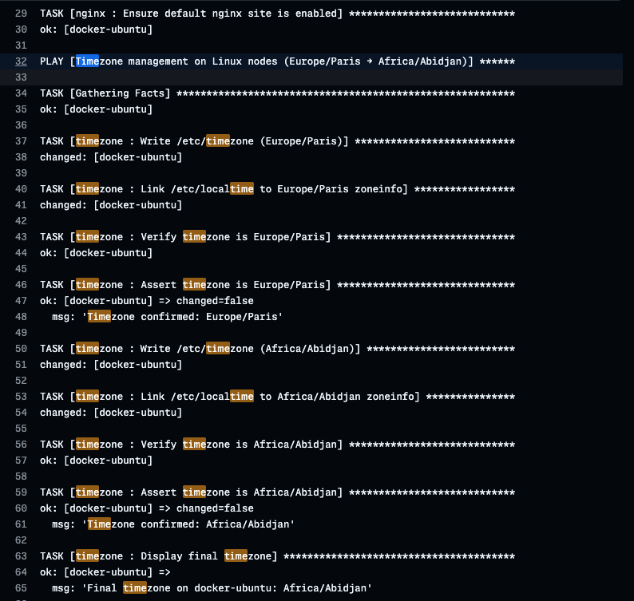
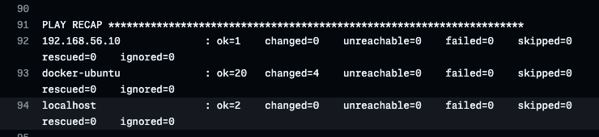

# 08 – Preuves d'Exécution (Captures d'Écran)

## 1. Pipeline complet en vert

Les 3 jobs — **Validate Terraform**, **Start Ubuntu Target Container**, **Deploy to Linux + Windows** — s'exécutent avec succès en 1m 38s.



---

## 2. Preuve du runner auto-hébergé

Le log "Set up job" du premier job affiche explicitement :

- **Runner name : `MacBook-Louisan`**
- **Machine name : `Mac`**

Ce n'est pas un runner partagé GitHub — c'est la machine locale du développeur.



---

## 3. Build Docker et historique des jobs

Construction du conteneur `ubuntu-target` via `docker compose up -d --build` (toutes les couches en cache), suivie de l'historique des exécutions successives du pipeline côté runner.



---

## 4. Log Ansible – Gestion du fuseau horaire

Extrait du play **"Timezone management on Linux nodes (Europe/Paris → Africa/Abidjan)"** :

| Tâche | Résultat |
|---|---|
| Write /etc/timezone (Europe/Paris) | `changed` |
| Link /etc/localtime → Europe/Paris | `changed` |
| Assert timezone is Europe/Paris | `ok` — `'Timezone confirmed: Europe/Paris'` |
| Write /etc/timezone (Africa/Abidjan) | `changed` |
| Link /etc/localtime → Africa/Abidjan | `changed` |
| Assert timezone is Africa/Abidjan | `ok` — `'Timezone confirmed: Africa/Abidjan'` |
| Display final timezone | `'Final timezone on docker-ubuntu: Africa/Abidjan'` |



---

## 5. PLAY RECAP – Résumé de l'exécution

```
PLAY RECAP
192.168.56.10  : ok=1   changed=0   unreachable=0   failed=0
docker-ubuntu  : ok=20  changed=4   unreachable=0   failed=0
localhost      : ok=2   changed=0   unreachable=0   failed=0
```

**0 échec sur tous les hôtes.**



---

## 6. Serveur nginx opérationnel

Vérification directe que nginx sert bien la page HTML sur le port 80 du conteneur (exposé en 8080 sur l'hôte) :

```bash
curl http://127.0.0.1:80
# → <html><body><h1>It works!</h1></body></html>
```


